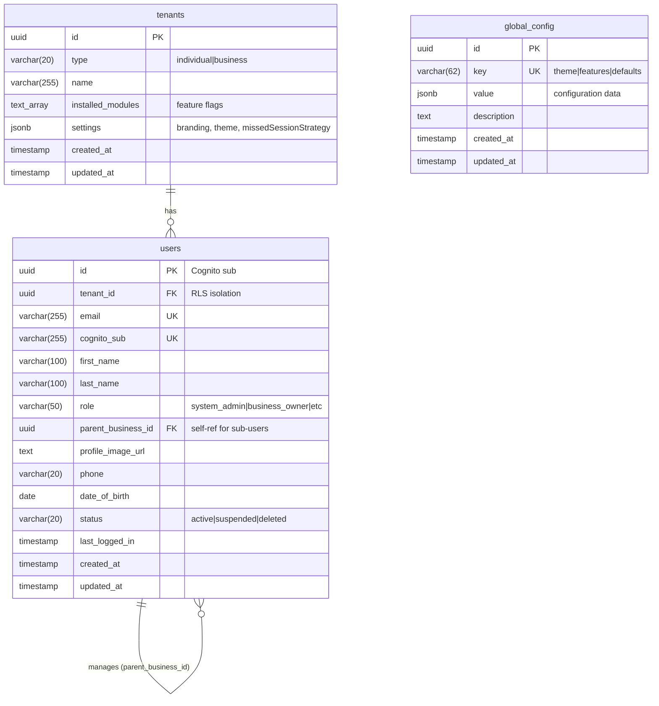
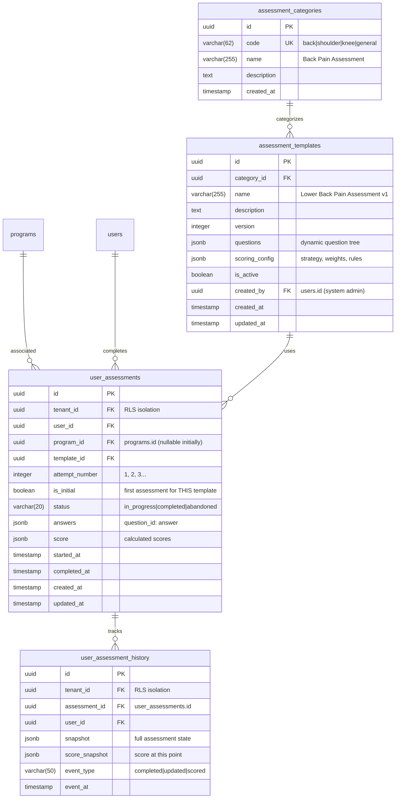
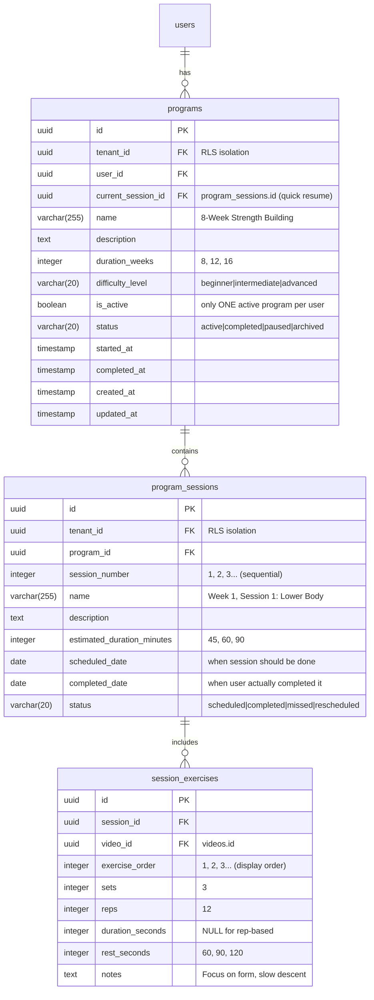
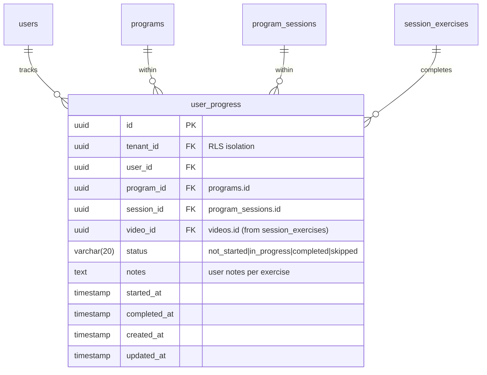
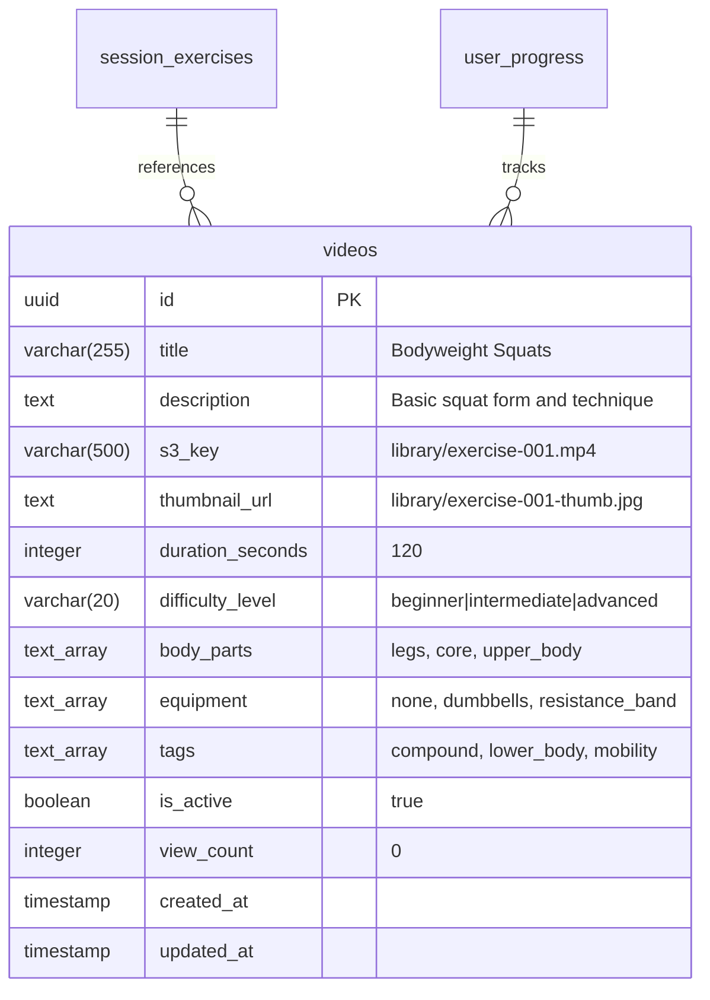
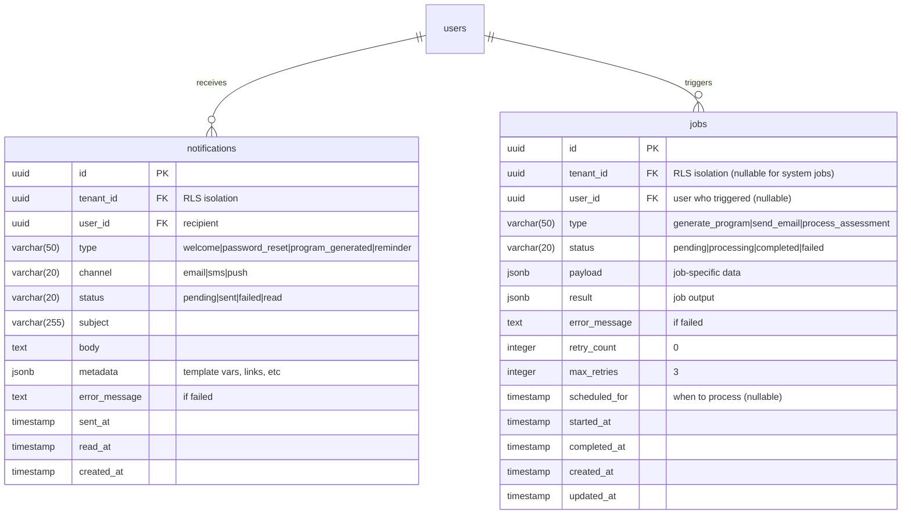
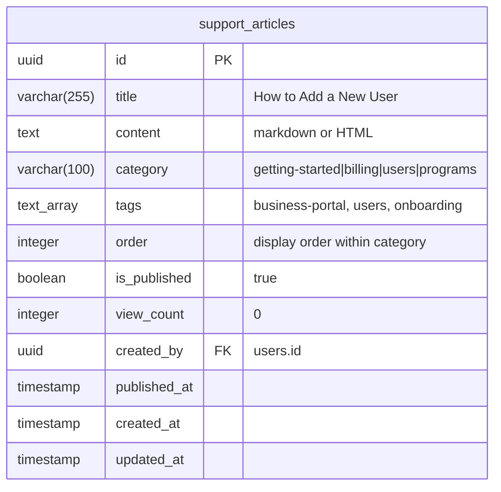
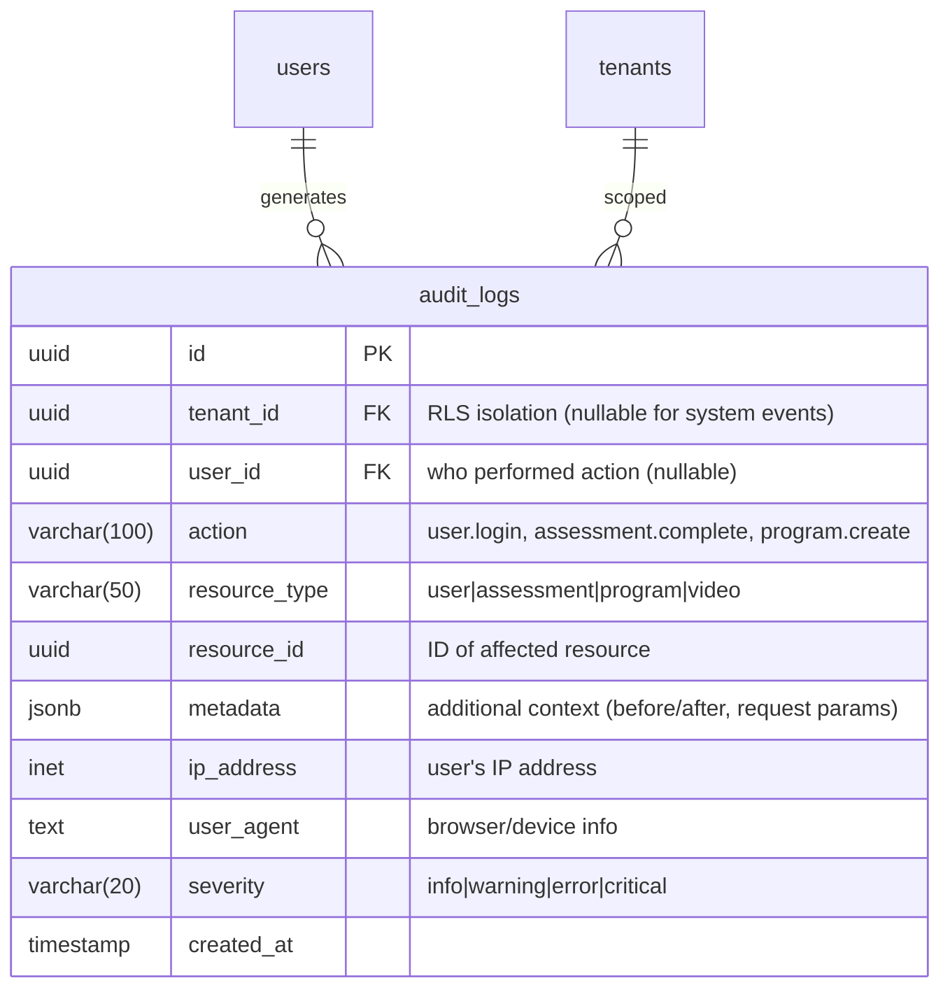

# FFP - Database Entity Relationship Diagram

## Overview

This document contains the complete ERD for the Fit For Purpose platform. The database uses PostgreSQL with Row-Level Security (RLS) for multi-tenant isolation.

**Key Principles:**
- All tenant-scoped tables include `tenant_id` for RLS policies
- System-managed content (templates, videos) has no `tenant_id`
- UUIDs used for all primary keys
- Timestamps for audit trails

---

## Phase 1: Core Multi-Tenant Foundation



**Indexes:**
- `idx_global_config_key` on global_config(key)
- `idx_users_tenant_id` on users(tenant_id)
- `idx_users_email` on users(email)
- `idx_users_parent_business_id` on users(parent_business_id) WHERE parent_business_id IS NOT NULL

**RLS Policy:**
```sql
-- users table
CREATE POLICY tenant_isolation_users ON users
  FOR ALL
  USING (tenant_id = current_setting('app.tenant_id', true)::UUID);

-- No RLS on global_config - system-wide settings
-- No RLS on tenants - users can only see their own tenant via application logic
```

**Tenant Settings Structure:**
```typescript
tenants.settings = {
  // Theme overrides (falls back to global_config.theme)
  theme: {
    primary: '#007bff',
    secondary: '#6c757d',
    logo_url: 's3://...',
  },
  
  // Missed session handling strategy
  missedSessionStrategy: 'reschedule' | 'accumulate' | 'flexible',
  
  // Business-specific settings
  allowCustomVideos: false,
  requireAssessmentReview: true,
  
  // Notification preferences
  notifications: {
    welcomeEmail: true,
    programReminders: true,
    weeklyDigest: false,
  }
}
```

---

## Phase 2: Assessment Engine



**Indexes:**
- `idx_assessment_templates_category` on assessment_templates(category_id)
- `idx_assessment_templates_active` on assessment_templates(is_active) WHERE is_active = true
- `idx_user_assessments_tenant_user` on user_assessments(tenant_id, user_id)
- `idx_user_assessments_program` on user_assessments(program_id)
- `idx_user_assessments_status` on user_assessments(status)
- `idx_user_assessment_history_assessment` on user_assessment_history(assessment_id, event_at DESC)

**RLS Policies:**
```sql
-- user_assessments table
CREATE POLICY tenant_isolation_assessments ON user_assessments
  FOR ALL
  USING (tenant_id = current_setting('app.tenant_id', true)::UUID);

-- user_assessment_history table
CREATE POLICY tenant_isolation_assessment_history ON user_assessment_history
  FOR ALL
  USING (tenant_id = current_setting('app.tenant_id', true)::UUID);
```

**Business Logic Notes:**
- **CHANGED:** `program_id` added to user_assessments (nullable initially)
- Users can complete multiple assessments that contribute to ONE active program
- Assessment flow:
  1. User completes assessment
  2. Find user's active program OR create new program
  3. Associate assessment with program via `program_id`
- `attempt_number` increments for each new assessment of the same template by a user
- `is_initial = true` marks the first completed assessment for THAT template (one per template_id per user)
- History snapshots created on: assessment completion, score updates, major edits

**Example Queries:**
```sql
-- Get INITIAL score for a specific template
SELECT score 
FROM user_assessments 
WHERE user_id = ? 
  AND template_id = ? 
  AND is_initial = true;

-- Get all assessments for a program
SELECT 
  ua.*,
  at.name as template_name,
  at.category_id
FROM user_assessments ua
JOIN assessment_templates at ON at.id = ua.template_id
WHERE ua.program_id = ?
  AND ua.tenant_id = ?
ORDER BY ua.completed_at DESC;

-- Get user's assessment history across programs
SELECT 
  ua.id,
  ua.attempt_number,
  ua.score,
  ua.completed_at,
  p.name as program_name,
  at.name as template_name
FROM user_assessments ua
JOIN programs p ON p.id = ua.program_id
JOIN assessment_templates at ON at.id = ua.template_id
WHERE ua.user_id = ?
  AND ua.tenant_id = ?
  AND ua.status = 'completed'
ORDER BY ua.completed_at DESC;
```

---

## Phase 3: Programs & Sessions



**Indexes:**
- `idx_programs_tenant_user` on programs(tenant_id, user_id)
- `idx_programs_active` on programs(is_active) WHERE is_active = true
- `idx_programs_status` on programs(status)
- `idx_program_sessions_program` on program_sessions(program_id, session_number)
- `idx_program_sessions_scheduled` on program_sessions(scheduled_date) WHERE status = 'scheduled'
- `idx_session_exercises_session` on session_exercises(session_id, exercise_order)
- `idx_session_exercises_video` on session_exercises(video_id)

**Unique Constraints:**
- `UNIQUE(tenant_id, user_id, is_active)` WHERE is_active = true - Only ONE active program per user
- `UNIQUE(program_id, session_number)` on program_sessions
- `UNIQUE(session_id, exercise_order)` on session_exercises

**RLS Policies:**
```sql
-- programs table
CREATE POLICY tenant_isolation_programs ON programs
  FOR ALL
  USING (tenant_id = current_setting('app.tenant_id', true)::UUID);

-- program_sessions table
CREATE POLICY tenant_isolation_sessions ON program_sessions
  FOR ALL
  USING (tenant_id = current_setting('app.tenant_id', true)::UUID);
```

**Business Logic Notes:**
- **CHANGED:** Removed `assessment_id` from programs - assessments now reference programs
- **CHANGED:** Added `is_active` - users can only have ONE active program at a time
- **CHANGED:** Added scheduling fields to `program_sessions`
- Programs generated from first assessment or created manually
- Additional assessments associate with the active program
- When program completed, user can start new program
- Session scheduling:
  - `scheduled_date` set when program created/session generated
  - `completed_date` set when all exercises in session completed
  - `status` tracks lifecycle: scheduled → completed/missed/rescheduled
- Missed session handling via `tenants.settings.missedSessionStrategy`:
  - **reschedule**: Auto-push all future sessions forward
  - **accumulate**: Let sessions pile up, work through backlog
  - **flexible**: Smart rescheduling based on completion patterns

**Example Queries:**
```sql
-- Get user's ACTIVE program with current session
SELECT 
  p.*,
  ps.session_number,
  ps.name as current_session_name,
  ps.scheduled_date,
  ps.status as session_status
FROM programs p
LEFT JOIN program_sessions ps ON ps.id = p.current_session_id
WHERE p.user_id = ? 
  AND p.tenant_id = ?
  AND p.is_active = true
LIMIT 1;

-- Check for missed sessions and reschedule (based on strategy)
WITH missed_sessions AS (
  SELECT id, session_number, scheduled_date
  FROM program_sessions
  WHERE program_id = ?
    AND status = 'scheduled'
    AND scheduled_date < CURRENT_DATE
)
UPDATE program_sessions
SET 
  status = 'missed',
  updated_at = NOW()
WHERE id IN (SELECT id FROM missed_sessions)
RETURNING *;

-- Reschedule remaining sessions (for 'reschedule' strategy)
UPDATE program_sessions ps
SET 
  scheduled_date = scheduled_date + INTERVAL '? days',
  status = 'rescheduled',
  updated_at = NOW()
FROM (
  SELECT MIN(session_number) as first_missed_session
  FROM program_sessions
  WHERE program_id = ? AND status = 'missed'
) missed
WHERE ps.program_id = ?
  AND ps.session_number >= missed.first_missed_session
  AND ps.status IN ('scheduled', 'rescheduled')
RETURNING ps.*;

-- Get upcoming scheduled sessions
SELECT 
  ps.*,
  COUNT(se.id) as total_exercises
FROM program_sessions ps
JOIN session_exercises se ON se.session_id = ps.id
WHERE ps.program_id = ?
  AND ps.status = 'scheduled'
  AND ps.scheduled_date >= CURRENT_DATE
GROUP BY ps.id
ORDER BY ps.scheduled_date ASC
LIMIT 7;

-- Mark session as completed
UPDATE program_sessions
SET 
  status = 'completed',
  completed_date = CURRENT_DATE,
  updated_at = NOW()
WHERE id = ?
  AND tenant_id = ?
RETURNING *;
```

---

## Phase 3.5: Progress Tracking



**Indexes:**
- `idx_user_progress_tenant_user` on user_progress(tenant_id, user_id)
- `idx_user_progress_session` on user_progress(session_id)
- `idx_user_progress_program_user` on user_progress(program_id, user_id)
- `idx_user_progress_status` on user_progress(status)

**Unique Constraints:**
- `UNIQUE(tenant_id, user_id, session_id, video_id)` - One record per exercise per session per user

**RLS Policies:**
```sql
-- user_progress table
CREATE POLICY tenant_isolation_progress ON user_progress
  FOR ALL
  USING (tenant_id = current_setting('app.tenant_id', true)::UUID);
```

**Business Logic Notes:**
- Tracks completion of each exercise within each session
- `status = 'completed'` means the exercise is done (regardless of sets/reps completion)
- When all exercises in session completed → update `program_sessions.completed_date`
- Session completion triggers check for missed sessions and potential rescheduling

---

## Phase 4: Video Library



**Indexes:**
- `idx_videos_difficulty` on videos(difficulty_level)
- `idx_videos_body_parts` on videos USING GIN(body_parts)
- `idx_videos_equipment` on videos USING GIN(equipment)
- `idx_videos_tags` on videos USING GIN(tags)
- `idx_videos_active` on videos(is_active) WHERE is_active = true
- `idx_videos_view_count` on videos(view_count DESC)

**RLS Policies:**
```sql
-- No RLS on videos table - system-managed content
-- All users can read videos, only system admins can write
```

---

## Phase 5: Background Jobs & Notifications



**Indexes:**
- `idx_jobs_status` on jobs(status) WHERE status IN ('pending', 'processing')
- `idx_jobs_scheduled` on jobs(scheduled_for) WHERE scheduled_for IS NOT NULL
- `idx_jobs_tenant_user` on jobs(tenant_id, user_id)
- `idx_jobs_type` on jobs(type)
- `idx_notifications_user_status` on notifications(user_id, status)
- `idx_notifications_type` on notifications(type)
- `idx_notifications_created` on notifications(created_at DESC)

**RLS Policies:**
```sql
-- jobs table
CREATE POLICY tenant_isolation_jobs ON jobs
  FOR ALL
  USING (
    tenant_id IS NULL  -- System jobs visible to admins only
    OR tenant_id = current_setting('app.tenant_id', true)::UUID
  );

-- notifications table
CREATE POLICY tenant_isolation_notifications ON notifications
  FOR ALL
  USING (tenant_id = current_setting('app.tenant_id', true)::UUID);
```

**Business Logic Notes:**

**Jobs Table:**
- Async background job processing (program generation, emails, etc.)
- `tenant_id` nullable for system-wide jobs
- Retry logic with exponential backoff
- `scheduled_for` enables delayed job execution
- Job types:
  - `generate_program`: Create program from assessment
  - `send_email`: Queue email sending
  - `process_assessment`: Score assessment
  - `reschedule_sessions`: Handle missed sessions
  - `generate_report`: Create analytics reports

**Concurrency Control (Database Protection):**

To prevent overloading the database with automated jobs and impacting user experience:

**1. S3 Concurrency Configuration**
   - Store job concurrency limits in S3: `s3://ffp-config-{env}/jobs/concurrency.json`
   - No database connection needed to read limits
   - Can update limits without code deployment
   - Versioned structure from the start for easy evolution

**2. EventBridge Scheduled Lambda** (runs every 1 minute)
   - Reads concurrency config from S3
   - Checks current in-progress job counts per type
   - Only triggers new jobs if under concurrency limit
   - Prevents database overload from automated processes

**3. Configuration Evolution Path**

**Phase 1 - Global Limits** (MVP - use this from the start):
```json
{
  "version": "1.0.0",
  "lastUpdated": "2025-10-07T10:00:00Z",
  "globalLimits": {
    "process_assessment": 50,
    "generate_program": 30,
    "send_email": 100,
    "reschedule_sessions": 20,
    "generate_report": 10
  }
}
```

**Phase 2 - Reserved Capacity** (when one tenant >30% of jobs):
```json
{
  "version": "2.0.0",
  "lastUpdated": "2026-03-15T14:30:00Z",
  "globalLimits": {
    "process_assessment": 50,
    "generate_program": 30,
    "send_email": 100,
    "reschedule_sessions": 20,
    "generate_report": 10
  },
  "reservedCapacity": {
    "tenant-large-clinic-uuid": {
      "process_assessment": 20,
      "generate_program": 10
    }
  }
}
```

**Phase 3 - Per-Tenant Quotas** (10K+ users, multiple large tenants):
```json
{
  "version": "3.0.0",
  "lastUpdated": "2027-06-20T09:00:00Z",
  "globalLimits": {
    "process_assessment": 100,
    "generate_program": 60,
    "send_email": 200,
    "reschedule_sessions": 40,
    "generate_report": 20
  },
  "tenantQuotas": {
    "tenant-enterprise-1": {
      "process_assessment": 30,
      "generate_program": 15,
      "priority": "high"
    },
    "tenant-enterprise-2": {
      "process_assessment": 25,
      "generate_program": 12,
      "priority": "high"
    }
  },
  "defaultTenantQuota": {
    "process_assessment": 5,
    "generate_program": 3,
    "priority": "normal"
  }
}
```

**4. Job Processor Lambda Logic (Phase 1)**:
```typescript
// 1. Read concurrency config from S3 (no DB needed)
const configData = await s3.getObject({
  Bucket: 'ffp-config-prod',
  Key: 'jobs/concurrency.json'
}).then(data => JSON.parse(data.Body.toString()));

const { version, globalLimits } = configData;
console.log(`Using concurrency config version: ${version}`);

// 2. Check current in-progress counts per job type
const inProgressCounts = await db.query(`
  SELECT type, COUNT(*) as count
  FROM jobs
  WHERE status = 'processing'
  GROUP BY type
`);

// 3. For each job type, trigger jobs if under global limit
for (const [jobType, globalLimit] of Object.entries(globalLimits)) {
  const currentCount = inProgressCounts[jobType] || 0;
  const available = globalLimit - currentCount;

  if (available > 0) {
    // Get pending jobs of this type
    const pendingJobs = await db.query(`
      SELECT * FROM jobs
      WHERE type = ? AND status = 'pending'
      ORDER BY created_at ASC
      LIMIT ?
    `, [jobType, available]);

    // Trigger Lambda for each job
    for (const job of pendingJobs) {
      await lambda.invoke({
        FunctionName: `ffp-job-worker-${jobType}`,
        InvocationType: 'Event',
        Payload: JSON.stringify({ jobId: job.id })
      });
    }
  }
}
```

**5. Job Processor Lambda Logic (Phase 2 - Reserved Capacity)**:
```typescript
const { version, globalLimits, reservedCapacity = {} } = configData;

// Check in-progress counts per job type AND per tenant
const inProgressCounts = await db.query(`
  SELECT 
    type,
    tenant_id,
    COUNT(*) as count
  FROM jobs
  WHERE status = 'processing'
  GROUP BY type, tenant_id
`);

for (const [jobType, globalLimit] of Object.entries(globalLimits)) {
  // Calculate available capacity
  const totalInProgress = inProgressCounts
    .filter(c => c.type === jobType)
    .reduce((sum, c) => sum + c.count, 0);
  
  let availableGlobal = globalLimit - totalInProgress;

  // Process reserved capacity tenants first
  for (const [tenantId, tenantLimits] of Object.entries(reservedCapacity)) {
    if (!tenantLimits[jobType]) continue;

    const tenantInProgress = inProgressCounts
      .find(c => c.type === jobType && c.tenant_id === tenantId)
      ?.count || 0;
    
    const tenantAvailable = tenantLimits[jobType] - tenantInProgress;

    if (tenantAvailable > 0) {
      const pendingJobs = await db.query(`
        SELECT * FROM jobs
        WHERE type = ? AND tenant_id = ? AND status = 'pending'
        ORDER BY created_at ASC
        LIMIT ?
      `, [jobType, tenantId, tenantAvailable]);

      // Trigger reserved capacity jobs
      for (const job of pendingJobs) {
        await lambda.invoke({
          FunctionName: `ffp-job-worker-${jobType}`,
          InvocationType: 'Event',
          Payload: JSON.stringify({ jobId: job.id })
        });
        availableGlobal--;
      }
    }
  }

  // Process remaining capacity for non-reserved tenants
  if (availableGlobal > 0) {
    const reservedTenantIds = Object.keys(reservedCapacity);
    const pendingJobs = await db.query(`
      SELECT * FROM jobs
      WHERE type = ?
        AND status = 'pending'
        AND (tenant_id NOT IN (?) OR tenant_id IS NULL)
      ORDER BY created_at ASC
      LIMIT ?
    `, [jobType, reservedTenantIds, availableGlobal]);

    for (const job of pendingJobs) {
      await lambda.invoke({
        FunctionName: `ffp-job-worker-${jobType}`,
        InvocationType: 'Event',
        Payload: JSON.stringify({ jobId: job.id })
      });
    }
  }
}
```

**6. Benefits**:
   - Prevents database connection exhaustion
   - Protects user-facing queries from slow background jobs
   - Configurable per job type without code changes
   - Easy to adjust limits based on system load
   - No database hit to check limits (S3 only)
   - Versioned config supports evolution without breaking changes
   - Clear upgrade path from Phase 1 → 2 → 3

**7. Monitoring**:
   - Track job queue depth per type
   - Track job queue depth per tenant (Phase 2+)
   - Alert if pending jobs exceed threshold
   - CloudWatch metrics:
     - `JobQueueDepth` by job type
     - `JobConcurrency` by job type
     - `JobQueueDepth` by tenant (Phase 2+)
     - `ConfigVersion` - track which version is active

**8. When to Evolve**:
   - **Phase 1 → Phase 2**: When one tenant represents >30% of total jobs OR large tenant onboarding (1000+ users)
   - **Phase 2 → Phase 3**: When multiple large tenants (10K+ total users) OR need SLA guarantees per tenant

**Notifications Table:**
- Email/SMS/Push notification queue and log
- Track delivery status and read receipts
- Notification types:
  - `welcome`: New user onboarding
  - `password_reset`: Password recovery flow
  - `program_generated`: Program ready notification
  - `reminder`: Workout reminders
  - `assessment_due`: Re-assessment reminders
  - `session_scheduled`: Upcoming session alerts

**Example Queries:**
```sql
-- Create program generation job
INSERT INTO jobs (
  id, tenant_id, user_id, type, status, payload, created_at, updated_at
)
VALUES (
  gen_random_uuid(), ?, ?, 'generate_program', 'pending',
  jsonb_build_object(
    'assessment_id', ?,
    'user_id', ?,
    'template_preferences', ?
  ),
  NOW(), NOW()
)
RETURNING *;

-- Get next pending job to process
SELECT * FROM jobs
WHERE status = 'pending'
  AND (scheduled_for IS NULL OR scheduled_for <= NOW())
ORDER BY created_at ASC
LIMIT 1
FOR UPDATE SKIP LOCKED;

-- Mark job as processing
UPDATE jobs
SET 
  status = 'processing',
  started_at = NOW(),
  updated_at = NOW()
WHERE id = ?
RETURNING *;

-- Complete job successfully
UPDATE jobs
SET 
  status = 'completed',
  result = ?::jsonb,
  completed_at = NOW(),
  updated_at = NOW()
WHERE id = ?;

-- Fail job with retry
UPDATE jobs
SET 
  status = CASE 
    WHEN retry_count < max_retries THEN 'pending'
    ELSE 'failed'
  END,
  retry_count = retry_count + 1,
  error_message = ?,
  updated_at = NOW()
WHERE id = ?;

-- Queue welcome email notification
INSERT INTO notifications (
  id, tenant_id, user_id, type, channel, status,
  subject, body, metadata, created_at
)
VALUES (
  gen_random_uuid(), ?, ?, 'welcome', 'email', 'pending',
  'Welcome to Fit For Purpose!',
  'Hi {{firstName}}, welcome to FFP...',
  jsonb_build_object(
    'firstName', ?,
    'loginUrl', ?
  ),
  NOW()
)
RETURNING *;

-- Get user's unread notifications
SELECT *
FROM notifications
WHERE user_id = ?
  AND tenant_id = ?
  AND status = 'sent'
  AND read_at IS NULL
ORDER BY created_at DESC
LIMIT 20;

-- Mark notification as read
UPDATE notifications
SET 
  status = 'read',
  read_at = NOW()
WHERE id = ?
  AND tenant_id = ?;
```

---

## Phase 6: Support Content



**Indexes:**
- `idx_support_articles_category` on support_articles(category)
- `idx_support_articles_published` on support_articles(is_published) WHERE is_published = true
- `idx_support_articles_tags` on support_articles USING GIN(tags)
- `idx_support_articles_order` on support_articles(category, order)

**RLS Policies:**
```sql
-- No RLS on support_articles - public content
-- All users can read, only system admins can write
```

**Business Logic Notes:**
- CMS for support documentation shown in business portal
- Markdown or HTML content for rich formatting
- Categorized for easy navigation
- Tagging for search functionality
- Order field for manual sorting within categories
- `is_published` allows drafting before publishing
- Categories: `getting-started`, `billing`, `users`, `programs`, `assessments`, `videos`, `troubleshooting`

**Example Queries:**
```sql
-- Get all published articles in a category
SELECT 
  id, title, category, tags, view_count
FROM support_articles
WHERE is_published = true
  AND category = 'getting-started'
ORDER BY "order" ASC, title ASC;

-- Search support articles by tag
SELECT *
FROM support_articles
WHERE is_published = true
  AND tags && ARRAY['business-portal']
ORDER BY view_count DESC;

-- Full-text search
SELECT *
FROM support_articles
WHERE is_published = true
  AND (
    title ILIKE '%user%'
    OR content ILIKE '%user%'
  )
ORDER BY view_count DESC;

-- Increment view count
UPDATE support_articles
SET 
  view_count = view_count + 1,
  updated_at = NOW()
WHERE id = ?;
```

---

## Phase 7: Audit Logging



**Indexes:**
- `idx_audit_logs_tenant` on audit_logs(tenant_id)
- `idx_audit_logs_user` on audit_logs(user_id)
- `idx_audit_logs_action` on audit_logs(action)
- `idx_audit_logs_resource` on audit_logs(resource_type, resource_id)
- `idx_audit_logs_created_at` on audit_logs(created_at DESC)
- `idx_audit_logs_severity` on audit_logs(severity) WHERE severity IN ('error', 'critical')

**Partitioning Strategy (Phase 2+):**
```sql
-- Partition by month for efficient archival and querying
CREATE TABLE audit_logs_2025_01 PARTITION OF audit_logs
  FOR VALUES FROM ('2025-01-01') TO ('2025-02-01');
```

**RLS Policies:**
```sql
-- audit_logs table - system admins see all, business owners see their tenant
CREATE POLICY audit_logs_system_admin ON audit_logs
  FOR SELECT
  USING (
    EXISTS (
      SELECT 1 FROM users
      WHERE users.id = current_setting('app.user_id', true)::UUID
      AND users.role = 'system_admin'
    )
  );

CREATE POLICY audit_logs_business_owner ON audit_logs
  FOR SELECT
  USING (
    tenant_id = current_setting('app.tenant_id', true)::UUID
    AND EXISTS (
      SELECT 1 FROM users
      WHERE users.id = current_setting('app.user_id', true)::UUID
      AND users.role IN ('business_owner', 'business_admin')
    )
  );

-- Individual users cannot see audit logs
```

**Business Logic Notes:**

**What to Audit:**
1. **Authentication Events**
   - `auth.login` - Successful login
   - `auth.login_failed` - Failed login attempt
   - `auth.logout` - User logout
   - `auth.password_reset` - Password reset initiated
   - `auth.mfa_enabled` - MFA enabled (Phase 2+)

2. **Authorization Events**
   - `auth.access_denied` - Permission denied
   - `auth.role_changed` - User role updated
   - `auth.token_refresh` - JWT token refreshed

3. **Data Access Events**
   - `assessment.view` - Assessment viewed
   - `program.view` - Program viewed
   - `user.view` - User profile viewed (by business owner)
   - `video.access` - Video streaming URL generated

4. **Data Modification Events**
   - `assessment.create` - Assessment started
   - `assessment.complete` - Assessment completed
   - `assessment.update` - Assessment modified
   - `program.create` - Program generated
   - `program.update` - Program modified
   - `program.delete` - Program archived
   - `user.create` - User registered/invited
   - `user.update` - User profile updated
   - `user.suspend` - User account suspended
   - `user.delete` - User account deleted

5. **System Events**
   - `config.update` - System configuration changed
   - `tenant.create` - Tenant created
   - `tenant.update` - Tenant settings changed
   - `video.upload` - Video added to library
   - `support.create` - Support article published

6. **Compliance Events**
   - `data.export` - User data exported
   - `data.delete` - User data deleted (GDPR)
   - `consent.given` - User consent recorded
   - `consent.withdrawn` - User consent withdrawn

**Severity Levels:**
- `info`: Normal operations (login, view, etc.)
- `warning`: Noteworthy events (failed login, access denied)
- `error`: Errors that need investigation (system errors)
- `critical`: Security incidents (multiple failed logins, unauthorized access attempts)

**Metadata Examples:**
```typescript
// Authentication
metadata: {
  loginMethod: 'email',
  deviceType: 'mobile',
  previousLogin: '2025-10-05T14:30:00Z'
}

// Data modification
metadata: {
  before: { status: 'in_progress' },
  after: { status: 'completed' },
  changes: ['status', 'completed_at']
}

// Access denied
metadata: {
  attemptedAction: 'update',
  requiredRole: 'business_owner',
  actualRole: 'business_user',
  resourceId: 'program-123'
}

// Failed login
metadata: {
  reason: 'invalid_password',
  attemptCount: 3,
  accountLocked: false
}
```

**Retention Policy:**
- **Phase 1:** 90 days in hot storage (PostgreSQL)
- **Phase 2+:** 
  - 90 days hot (PostgreSQL)
  - 1 year warm (S3 + Athena for queries)
  - 7 years cold (S3 Glacier for compliance)

**Example Queries:**

```sql
-- Get user's recent activity
SELECT 
  action,
  resource_type,
  resource_id,
  ip_address,
  created_at
FROM audit_logs
WHERE user_id = ?
  AND tenant_id = ?
ORDER BY created_at DESC
LIMIT 50;

-- Security: Track failed login attempts
SELECT 
  user_id,
  ip_address,
  COUNT(*) as attempt_count,
  MAX(created_at) as last_attempt
FROM audit_logs
WHERE action = 'auth.login_failed'
  AND created_at > NOW() - INTERVAL '1 hour'
GROUP BY user_id, ip_address
HAVING COUNT(*) >= 5
ORDER BY attempt_count DESC;

-- Audit: Who accessed a specific resource?
SELECT 
  al.action,
  u.email,
  u.role,
  al.ip_address,
  al.created_at
FROM audit_logs al
JOIN users u ON u.id = al.user_id
WHERE al.resource_type = 'assessment'
  AND al.resource_id = ?
ORDER BY al.created_at DESC;

-- Compliance: Data access report for a user
SELECT 
  action,
  resource_type,
  resource_id,
  created_at,
  ip_address
FROM audit_logs
WHERE user_id = ?
  AND action LIKE '%.view'
  AND created_at BETWEEN ? AND ?
ORDER BY created_at DESC;

-- Security: Unauthorized access attempts
SELECT 
  al.*,
  u.email,
  u.role
FROM audit_logs al
JOIN users u ON u.id = al.user_id
WHERE al.action = 'auth.access_denied'
  AND al.severity IN ('warning', 'critical')
  AND al.created_at > NOW() - INTERVAL '7 days'
ORDER BY al.created_at DESC;

-- Business Analytics: Most active users
SELECT 
  u.email,
  u.first_name,
  u.last_name,
  COUNT(*) as action_count,
  COUNT(DISTINCT DATE(al.created_at)) as active_days
FROM audit_logs al
JOIN users u ON u.id = al.user_id
WHERE al.tenant_id = ?
  AND al.created_at > NOW() - INTERVAL '30 days'
  AND al.action NOT IN ('auth.token_refresh')
GROUP BY u.id, u.email, u.first_name, u.last_name
ORDER BY action_count DESC
LIMIT 20;

-- System Health: Error rate over time
SELECT 
  DATE_TRUNC('hour', created_at) as hour,
  COUNT(*) FILTER (WHERE severity = 'error') as error_count,
  COUNT(*) FILTER (WHERE severity = 'critical') as critical_count,
  COUNT(*) as total_count
FROM audit_logs
WHERE created_at > NOW() - INTERVAL '24 hours'
GROUP BY hour
ORDER BY hour DESC;

-- Tenant activity summary
SELECT 
  t.name as tenant_name,
  COUNT(DISTINCT al.user_id) as active_users,
  COUNT(*) as total_actions,
  COUNT(*) FILTER (WHERE al.action LIKE 'assessment.%') as assessment_actions,
  COUNT(*) FILTER (WHERE al.action LIKE 'program.%') as program_actions,
  COUNT(*) FILTER (WHERE al.action LIKE 'video.%') as video_actions
FROM tenants t
LEFT JOIN audit_logs al ON al.tenant_id = t.id
  AND al.created_at > NOW() - INTERVAL '7 days'
WHERE t.type = 'business'
GROUP BY t.id, t.name
ORDER BY total_actions DESC;
```

**Integration Points:**

```typescript
// Helper function to log audit events
export async function logAudit({
  tenantId,
  userId,
  action,
  resourceType,
  resourceId,
  metadata = {},
  ipAddress,
  userAgent,
  severity = 'info'
}: AuditLogParams) {
  await db.query(`
    INSERT INTO audit_logs (
      id, tenant_id, user_id, action, resource_type, resource_id,
      metadata, ip_address, user_agent, severity, created_at
    )
    VALUES (
      gen_random_uuid(), ?, ?, ?, ?, ?,
      ?::jsonb, ?::inet, ?, ?, NOW()
    )
  `, [
    tenantId,
    userId,
    action,
    resourceType,
    resourceId,
    JSON.stringify(metadata),
    ipAddress,
    userAgent,
    severity
  ]);
}

// Usage in Lambda functions
export const handler = async (event) => {
  const context = extractTenantContext(event);
  const ipAddress = event.requestContext.identity.sourceIp;
  const userAgent = event.requestContext.identity.userAgent;

  try {
    // Perform action
    const assessment = await assessmentService.complete(id, answers);

    // Log successful action
    await logAudit({
      tenantId: context.tenantId,
      userId: context.userId,
      action: 'assessment.complete',
      resourceType: 'assessment',
      resourceId: assessment.id,
      metadata: {
        templateId: assessment.template_id,
        score: assessment.score,
        duration: assessment.completed_at - assessment.started_at
      },
      ipAddress,
      userAgent,
      severity: 'info'
    });

    return { statusCode: 200, body: JSON.stringify(assessment) };
  } catch (error) {
    // Log error
    await logAudit({
      tenantId: context.tenantId,
      userId: context.userId,
      action: 'assessment.complete',
      resourceType: 'assessment',
      resourceId: id,
      metadata: {
        error: error.message,
        stack: error.stack
      },
      ipAddress,
      userAgent,
      severity: 'error'
    });

    throw error;
  }
};

// Middleware for automatic audit logging
export function withAuditLogging(handler, action, resourceType) {
  return async (event) => {
    const context = extractTenantContext(event);
    const startTime = Date.now();

    try {
      const result = await handler(event);

      // Auto-log successful actions
      await logAudit({
        tenantId: context.tenantId,
        userId: context.userId,
        action,
        resourceType,
        resourceId: result.id,
        metadata: { duration: Date.now() - startTime },
        ipAddress: event.requestContext.identity.sourceIp,
        userAgent: event.requestContext.identity.userAgent,
        severity: 'info'
      });

      return result;
    } catch (error) {
      // Auto-log errors
      await logAudit({
        tenantId: context.tenantId,
        userId: context.userId,
        action,
        resourceType,
        resourceId: event.pathParameters?.id,
        metadata: {
          error: error.message,
          duration: Date.now() - startTime
        },
        ipAddress: event.requestContext.identity.sourceIp,
        userAgent: event.requestContext.identity.userAgent,
        severity: 'error'
      });

      throw error;
    }
  };
}
```

**Best Practices:**

1. **Never log sensitive data**
   - ❌ Don't log: Passwords, tokens, full PHI details
   - ✅ Do log: User IDs, resource IDs, action types

2. **Log at the right level**
   - Log all authentication events
   - Log all data modifications
   - Log authorization failures
   - Don't log every read operation (too noisy)

3. **Use structured metadata**
   - Consistent JSON structure
   - Include enough context for debugging
   - Keep metadata reasonably sized (<1KB)

4. **Performance considerations**
   - Audit logging is async (fire-and-forget)
   - Don't block user requests waiting for audit logs
   - Use batch inserts for bulk operations

5. **Monitoring**
   - Alert on high error rates
   - Alert on suspicious patterns (many failed logins)
   - Track audit log growth rate

---

## Database Schema Version

**Version:** 2.0.0  
**Last Updated:** October 2025  
**Status:** Phase 1-6 Complete (Ready for Audit Logging)

## Breaking Changes (v1.0 → v2.0)

### 1. Programs ↔ Assessments Relationship (BREAKING)
**Before:** `programs.assessment_id` → `user_assessments`
**After:** `user_assessments.program_id` → `programs`

**Migration Impact:**
- Must migrate existing `programs.assessment_id` data
- Create `user_assessments.program_id` column
- Update application logic for assessment → program association

### 2. Programs: One Active Per User (BREAKING)
**Before:** Multiple programs could be active
**After:** Only ONE active program per user (`is_active` boolean)

**Migration Impact:**
- Add `is_active` column to programs
- Add unique constraint: `UNIQUE(tenant_id, user_id, is_active) WHERE is_active = true`
- Mark most recent program as active, others as archived

### 3. Session Scheduling (NEW FEATURE)
**Added:** `scheduled_date`, `completed_date`, `status` to `program_sessions`

**Migration Impact:**
- Add new columns to program_sessions
- Backfill scheduled_date for existing sessions
- Default status to 'completed' for sessions with user_progress records

## New Tables Added

1. **global_config** - System-wide configuration
2. **jobs** - Background job queue
3. **notifications** - Email/SMS notification queue
4. **support_articles** - CMS for support docs

## Total Tables: 15

**Tenant-Scoped (with RLS):** 8 tables
**System-Managed (no RLS):** 7 tables
