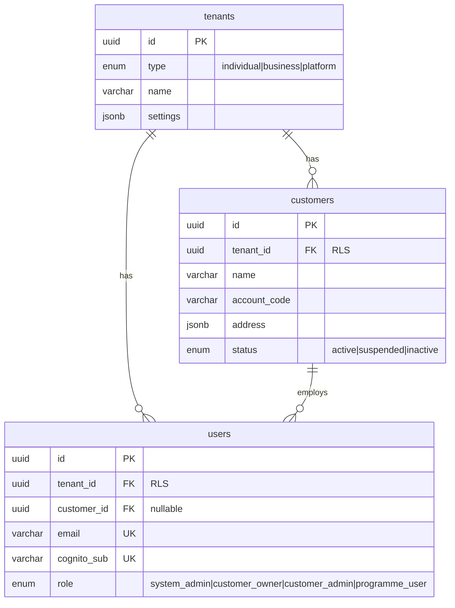
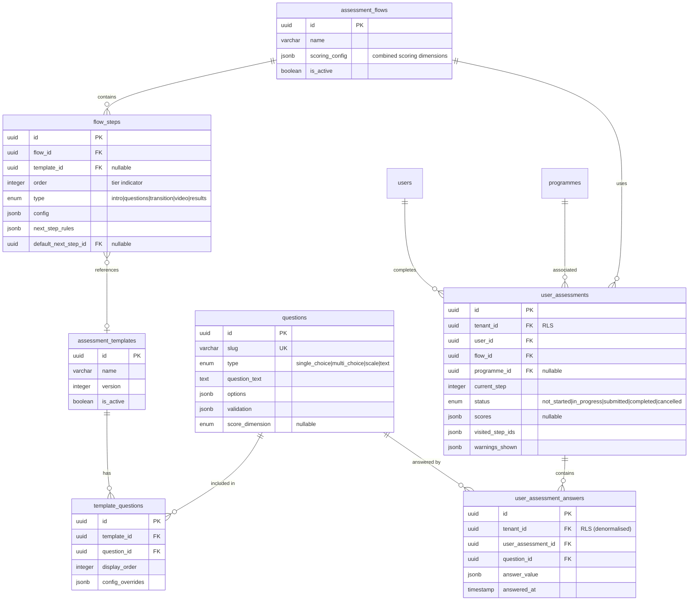
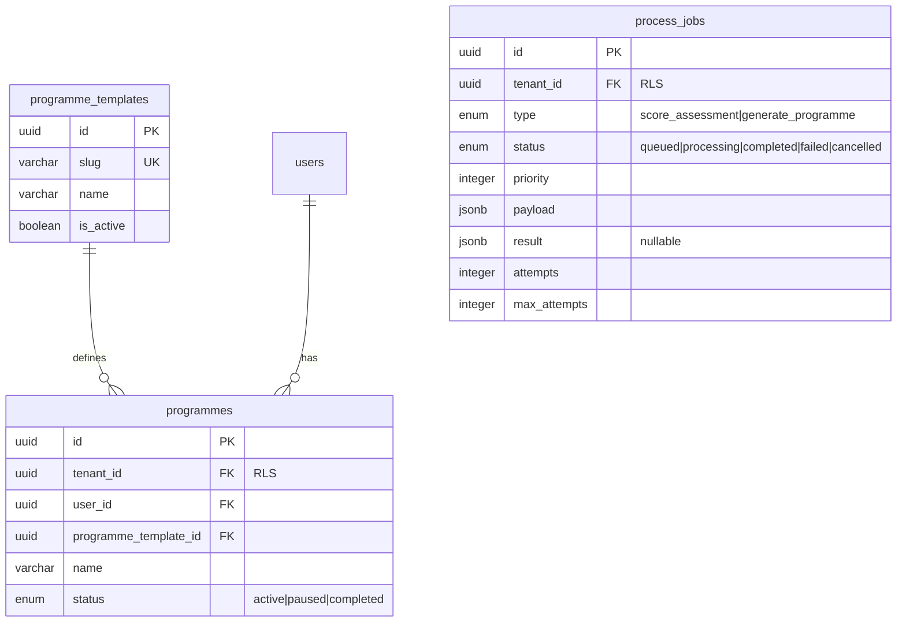

# FFP - Database Entity Relationship Diagram

## Overview

PostgreSQL database with Row-Level Security (RLS) for multi-tenant isolation. Schema definitions live in `packages/database/src/schema/` — the Drizzle schemas are the source of truth for column types, constraints, indexes, and relationships.

**Key Principles:**

- All tenant-scoped tables include `tenant_id` for RLS policies
- System-managed content (templates, questions, videos) has no `tenant_id`
- UUIDs for all primary keys
- Timestamps for audit trails
- Enums synchronised between PostgreSQL and Zod via `packages/database/src/constants/`

---

## Implemented Schema (13 tables)

### Multi-Tenant Foundation

```mermaid
erDiagram
    tenants ||--o{ customers : "has"
    tenants ||--o{ users : "has"
    customers ||--o{ users : "employs"

    tenants {
        uuid id PK
        enum type "individual|business|platform"
        varchar name
        jsonb settings
    }

    customers {
        uuid id PK
        uuid tenant_id FK "RLS"
        varchar name
        varchar account_code
        jsonb address
        enum status "active|suspended|inactive"
    }

    users {
        uuid id PK
        uuid tenant_id FK "RLS"
        uuid customer_id FK "nullable"
        varchar email UK
        varchar cognito_sub UK
        enum role "system_admin|customer_owner|customer_admin|programme_user"
    }
```

### Assessment Engine

```mermaid
erDiagram
    assessment_flows ||--o{ flow_steps : "contains"
    assessment_templates ||--o{ template_questions : "has"
    questions ||--o{ template_questions : "included in"
    flow_steps }o--o| assessment_templates : "references"
    assessment_flows ||--o{ user_assessments : "uses"
    users ||--o{ user_assessments : "completes"
    user_assessments ||--o{ user_assessment_answers : "contains"
    questions ||--o{ user_assessment_answers : "answered by"
    programmes ||--o{ user_assessments : "associated"

    assessment_flows {
        uuid id PK
        varchar name
        jsonb scoring_config "combined scoring dimensions"
        boolean is_active
    }

    flow_steps {
        uuid id PK
        uuid flow_id FK
        uuid template_id FK "nullable"
        integer order "tier indicator"
        enum type "intro|questions|transition|video|results"
        jsonb config
        jsonb next_step_rules
        uuid default_next_step_id FK "nullable"
    }

    assessment_templates {
        uuid id PK
        varchar name
        integer version
        boolean is_active
    }

    questions {
        uuid id PK
        varchar slug UK
        enum type "single_choice|multi_choice|scale|text"
        text question_text
        jsonb options
        jsonb validation
        enum score_dimension "nullable"
    }

    template_questions {
        uuid id PK
        uuid template_id FK
        uuid question_id FK
        integer display_order
        jsonb config_overrides
    }

    user_assessments {
        uuid id PK
        uuid tenant_id FK "RLS"
        uuid user_id FK
        uuid flow_id FK
        uuid programme_id FK "nullable"
        integer current_step
        enum status "not_started|in_progress|submitted|completed|cancelled"
        jsonb scores "nullable"
        jsonb visited_step_ids
        jsonb warnings_shown
    }

    user_assessment_answers {
        uuid id PK
        uuid tenant_id FK "RLS (denormalised)"
        uuid user_assessment_id FK
        uuid question_id FK
        jsonb answer_value
        timestamp answered_at
    }
```

### Programmes & Processing

```mermaid
erDiagram
    programme_templates ||--o{ programmes : "defines"
    users ||--o{ programmes : "has"

    programme_templates {
        uuid id PK
        varchar slug UK
        varchar name
        boolean is_active
    }

    programmes {
        uuid id PK
        uuid tenant_id FK "RLS"
        uuid user_id FK
        uuid programme_template_id FK
        varchar name
        enum status "active|paused|completed"
    }

    process_jobs {
        uuid id PK
        uuid tenant_id FK "RLS"
        enum type "score_assessment|generate_programme"
        enum status "queued|processing|completed|failed|cancelled"
        integer priority
        jsonb payload
        jsonb result "nullable"
        integer attempts
        integer max_attempts
    }
```

---

## RLS Summary

| Table                     | Tenant-Scoped | Notes                                                              |
| ------------------------- | :-----------: | ------------------------------------------------------------------ |
| `tenants`                 |       -       | Root entity                                                        |
| `customers`               |      ✅       |                                                                    |
| `users`                   |      ✅       |                                                                    |
| `user_assessments`        |      ✅       |                                                                    |
| `user_assessment_answers` |      ✅       | Denormalised `tenant_id` for policy efficiency                     |
| `programmes`              |      ✅       |                                                                    |
| `process_jobs`            |      ✅       | Job processor uses BYPASSRLS to claim; handlers set tenant context |
| `assessment_flows`        |       -       | System content                                                     |
| `flow_steps`              |       -       | System content                                                     |
| `assessment_templates`    |       -       | System content                                                     |
| `questions`               |       -       | System content                                                     |
| `template_questions`      |       -       | System join table                                                  |
| `programme_templates`     |       -       | System lookup                                                      |

---

## Future Entities (Not Yet Implemented)

These will be planned via Jira stories when needed. Concepts only — no schema detail until implementation.

### Sessions & Exercises

- **programme_sessions** — scheduled workout sessions within a programme (session number, scheduled/completed dates, status lifecycle)
- **session_exercises** — exercises within a session, referencing the video library (sets, reps, duration, rest, order)
- Missed session handling configurable per tenant via `tenants.settings.missedSessionStrategy`

### Progress Tracking

- **user_progress** — tracks completion of individual exercises within sessions
- Session completion derived from exercise completion status

### Video Library

- **videos** — system-managed exercise video catalogue (S3 key, difficulty, body parts, equipment tags)
- No RLS — system content accessible to all authenticated users
- GIN indexes for array column filtering (body_parts, equipment, tags)

### Notifications & Background Jobs

- **notifications** — email/SMS/push notification queue and delivery log
- Current `process_jobs` table may evolve to handle broader job types beyond assessment scoring

### Support Content

- **support_articles** — CMS for help documentation (categories, tags, publishing workflow)
- No RLS — public content

### Audit Logging

- **audit_logs** — authentication events, data modifications, authorisation failures, compliance events
- Tenant-scoped with special RLS (system admins see all, business owners see their tenant)
- Retention strategy: hot (PostgreSQL) → warm (S3 + Athena) → cold (Glacier)
- Partitioned by month for efficient archival

---

_For implemented table details (columns, constraints, indexes, relationships), refer to the Drizzle schema files in `packages/database/src/schema/`. The code is the source of truth._
